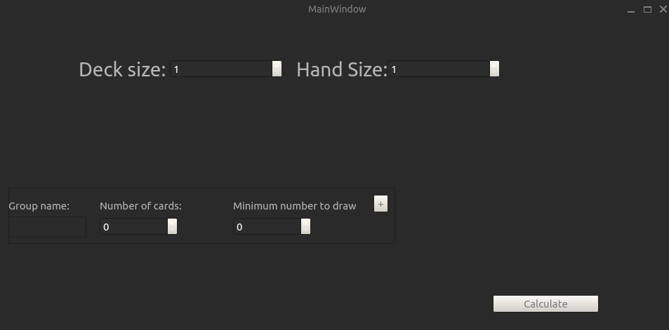
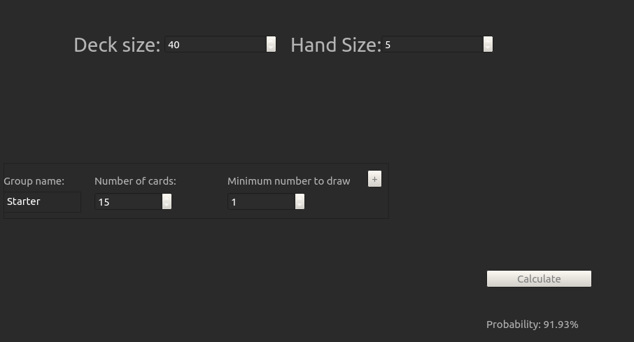
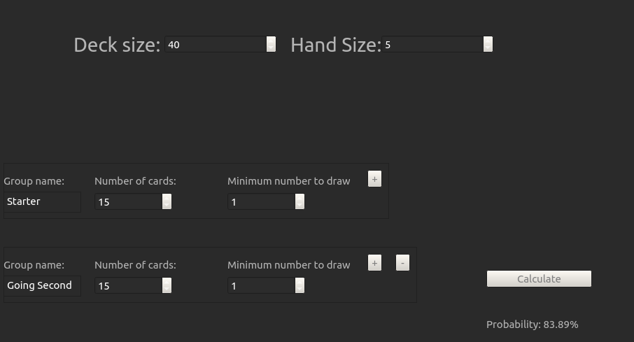

# CardCalc

Project for Programming Laboratory @ Unifi - Tool to calculate probability to optimize a deck of cards.

## How does it work?
On execution, you will see this:

Now you'll have to add the information about:
1. Deck size (the number of cards in the deck)
2. Hand size (the number of cards you will be drawing)
3. Group name (optional, label for the cards you wish to draw)
4. Number of cards (Number of labeled cards in the deck)
5. Minimum number to draw (Minimum number of labeled cards you want to draw)

Let's make an example:
> I have a 40 card deck and I will draw 5 cards, I want to know the probability to draw at least 1 starter card knowing that I have 15 of them in my deck. So I'll put the information in the correct SpinBoxes and click on the button "calculate"

This is what it looks like:

This is for drawing a single group, if you click on the "+" button, you will be able to add another group, up to 3 different groups. Using the same example from before:
> I have a 40 card deck and I will draw 5 cards, I want to know the probability to draw at least 1 starter card knowing that I have 15 of them in my deck **AND** at least 1 going second card knowing that I have 15 of them in my deck. So I'll put the information in the correct SpinBoxes and click on the button "calculate"

Once again, here's the result:

# Requirements
1. Qt6
2. a c++ compiler
